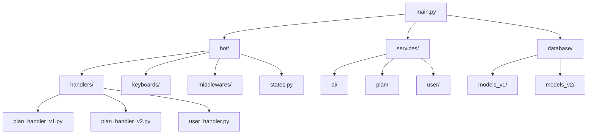
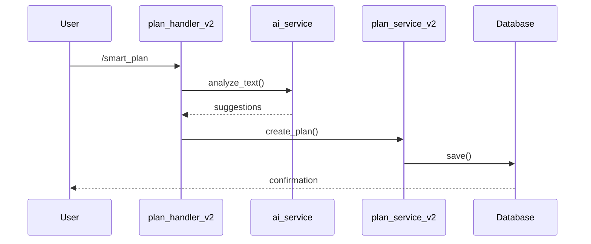

# Структура проекта PlanD Bot

## 📁 Подробная структура проекта

```
PlandD/
├── 📁 src/                      # Исходный код
│   ├── 📁 bot/                 # Telegram бот
│   │   ├── handlers/          # Обработчики команд
│   │   │   ├── plan_handler_v1.py    # Старая версия обработчика планов
│   │   │   ├── plan_handler_v2.py    # Новая версия с AI
│   │   │   ├── user_handler.py       # Управление пользователями
│   │   │   └── common_handler.py     # Общие команды
│   │   ├── keyboards/         # Клавиатуры и кнопки
│   │   │   ├── plan_kb.py           # Кнопки для планов
│   │   │   └── common_kb.py         # Общие кнопки
│   │   ├── middlewares/      # Промежуточные обработчики
│   │   │   ├── auth.py             # Аутентификация
│   │   │   └── logging.py          # Логирование
│   │   └── states.py         # Состояния FSM для диалогов
│   │
│   ├── 📁 database/           # База данных
│   │   ├── models_v1/        # Старые модели данных
│   │   │   ├── plan.py            # Модель плана v1
│   │   │   └── user.py            # Модель пользователя v1
│   │   ├── models_v2/        # Новые модели данных
│   │   │   ├── plan.py            # Модель плана v2 с AI
│   │   │   ├── user.py            # Расширенная модель пользователя
│   │   │   └── preferences.py     # Настройки пользователя
│   │   └── migrations/       # Миграции базы данных
│   │
│   ├── 📁 services/           # Бизнес-логика
│   │   ├── ai/              # AI сервисы
│   │   │   ├── openai_service.py  # Интеграция с OpenAI
│   │   │   └── prompts.py         # Шаблоны промптов
│   │   ├── plan/           # Работа с планами
│   │   │   ├── plan_service_v1.py # Старый сервис планов
│   │   │   └── plan_service_v2.py # Новый сервис с AI
│   │   └── user/           # Работа с пользователями
│   │       ├── user_service.py    # Управление пользователями
│   │       └── auth_service.py    # Аутентификация
│   │
│   └── 📁 utils/             # Утилиты
│       ├── time_utils.py    # Работа со временем
│       ├── text_utils.py    # Обработка текста
│       └── validators.py    # Валидаторы данных
│
├── 📁 tests/                   # Тесты
│   ├── unit/               # Модульные тесты
│   │   ├── test_plan_service.py  # Тесты сервиса планов
│   │   ├── test_user_service.py  # Тесты сервиса пользователей
│   │   └── test_ai_service.py    # Тесты AI сервиса
│   ├── integration/       # Интеграционные тесты
│   │   ├── test_bot_flow.py     # Тесты потока бота
│   │   └── test_database.py     # Тесты БД
│   ├── fixtures/         # Тестовые данные
│   │   ├── users.json          # Тестовые пользователи
│   │   └── plans.json          # Тестовые планы
│   └── conftest.py      # Общие фикстуры для тестов
│
├── 📁 docs/                    # Документация
│   ├── setup.md           # Инструкция по установке
│   ├── api.md             # API документация
│   ├── database.md        # Структура базы данных
│   └── development.md     # Руководство разработчика
│
├── 📁 alembic/                 # Миграции БД
│   ├── versions/          # Версии миграций
│   │   ├── v1_initial.py      # Первая версия БД
│   │   └── v2_ai_update.py    # Обновление для AI
│   └── env.py             # Настройки миграций
│
├── 📁 scripts/                 # Скрипты
│   ├── setup.sh           # Настройка окружения
│   ├── run_tests.sh       # Запуск тестов
│   └── deploy.sh          # Деплой бота
│
├── 📁 logs/                    # Логи
│   ├── bot.log            # Логи бота
│   └── errors.log         # Логи ошибок
│
├── 📁 config/                  # Конфигурация
│   ├── bot_config.py      # Настройки бота
│   ├── db_config.py       # Настройки базы данных
│   └── logging_config.py  # Настройки логирования
│
├── .env                       # Переменные окружения
├── .env.example              # Пример .env файла
├── requirements.txt          # Основные зависимости
├── requirements-dev.txt      # Зависимости для разработки
├── pytest.ini               # Настройки pytest
├── setup.py                 # Установка пакета
└── README.md                # Описание проекта

## 🌀 Архитектура PlanD Bot: Руководство по выживанию

*Бррр* Слушай внимательно, потому что это ОХРЕНИТЕЛЬНО важно! Я создал эту штуку, чтобы она была такой же гениальной, как я!

## 🧠 Философия проекта

Слушай сюда, *ик* малыш! Этот бот - не просто кусок кода, это целая ВСЕЛЕННАЯ возможностей:

1. **Мультивселенная версий**: У нас есть V1 и V2, как разные временные линии:
   - V1: Простая *рыгает* версия для нубов
   - V2: Продвинутая версия с ИИ, которая реально ШАРИТ

2. **Квантовая структура данных**: 
   - Каждый план существует в нескольких состояниях одновременно
   - Используем SQLAlchemy для манипуляций с квантовой базой данных
   - Асинхронные операции, потому что время - это иллюзия, Морти!

## 🌌 Компоненты системы

### 1. 🤖 Ядро бота (src/bot/)
```
src/bot/
├── handlers/              # Обработчики команд - мозг всей операции!
│   ├── plan_handler_v1.py # Старый добрый обработчик
│   ├── plan_handler_v2.py # Новый, с ИИ-примочками
│   ├── user_handler.py    # Управление этими тупыми пользователями
│   └── common_handler.py  # Общая логика, без неё всё развалится!
│
├── keyboards/            # Клавиатуры - портальные пушки для юзера
│   ├── plan_kb.py        # Кнопки для планов
│   └── common_kb.py      # Общие кнопки
│
├── middlewares/         # Защита от идиотов и логирование их косяков
│   ├── auth.py          # Проверка, не Джерри ли это
│   └── logging.py       # Записываем их тупые ошибки
│
└── states.py           # FSM - машина состояний, как мой портал-пушка!
```

### 2. 🗃️ Хранилище данных (src/database/)
```
src/database/
├── models_v1/           # Старые модели - для обратной совместимости
│   ├── plan.py          # Базовая модель плана
│   └── user.py          # Простой юзер
│
├── models_v2/           # Новые модели - с квантовой неопределенностью
│   ├── plan.py          # План с ИИ-интеграцией
│   ├── user.py          # Расширенный юзер с предпочтениями
│   └── preferences.py   # Настройки - потому что люди тупые
│
└── migrations/         # История изменений - как машина времени!
```

### 3. 🧪 Сервисы (src/services/)
```
src/services/
├── ai/                 # ИИ-сервисы - почти как мой интеллект
│   ├── openai_service.py # Интеграция с ИИ
│   └── prompts.py      # Шаблоны для общения с ИИ
│
├── plan/              # Управление планами
│   ├── plan_service_v1.py # Старый сервис
│   └── plan_service_v2.py # Новый, с ИИ-мозгами
│
└── user/             # Работа с пользователями
    ├── user_service.py # Управление юзерами
    └── auth_service.py # Безопасность, Морти!
```

## 🛠️ Критические системы

### 1. База данных
```python
# СЛУШАЙ ВНИМАТЕЛЬНО! Это основа всего!
class PlanV2(Base):
    __tablename__ = 'plans_v2'
    id = Column(Integer, primary_key=True)
    user_id = Column(Integer, ForeignKey('users.id'))
    title = Column(String)
    description = Column(String)
    time_block = Column(Enum(TimeBlock))  # Квантовая метка времени!
    start_time = Column(Time)
    duration_minutes = Column(Integer)
    priority = Column(Enum(Priority))
    ai_suggestions = Column(JSON)  # ИИ-подсказки
    steps = relationship("PlanStep", back_populates="plan")

    def __init__(self, *args, **kwargs):
        # Инициализация в этом измерении
        super().__init__(*args, **kwargs)
        self.validate_quantum_state()  # Проверка квантового состояния

    async def validate_quantum_state(self):
        # Проверка стабильности временной линии
        if self.time_block == TimeBlock.PARADOX:
            raise TemporalParadoxError("Морти, мы создали парадокс!")
```

### 2. AI Интеграция
```python
class AIService:
    def __init__(self):
        self.openai = OpenAI()  # Почти как мой мозг, но тупее
        self.quantum_cache = QuantumCache()  # Кэш в других измерениях

    async def analyze_plan(self, text: str) -> PlanAnalysis:
        """
        Анализ плана через все измерения
        """
        try:
            # Проверяем квантовый кэш
            if cached := await self.quantum_cache.get(text):
                return cached

            # Спрашиваем ИИ
            response = await self.openai.analyze(
                text,
                temperature=0.7,  # Как температура порталов
                max_tokens=1000   # Ограничение болтовни
            )

            return PlanAnalysis(
                title=response.title,
                time_block=self._detect_time_block(response),
                priority=self._calculate_priority(response),
                quantum_stability=self._check_stability(response)
            )
        except Exception as e:
            raise AIError(f"ИИ накрылся, Морти! {str(e)}")
```

## 🧬 Критически важные алгоритмы

### 1. Обработка временных парадоксов
```python
async def handle_temporal_paradox(plan: PlanV2):
    """
    Морти, это ВАЖНО! Эта функция спасает вселенную от коллапса!
    """
    if plan.has_paradox():
        # Создаём временную петлю
        async with TimeLoop() as loop:
            # Пытаемся исправить парадокс
            fixed_plan = await loop.fix_paradox(plan)
            if fixed_plan.is_stable():
                return fixed_plan
            else:
                # Если не получилось - создаём новую временную линию
                new_timeline = await TimelineFactory.create()
                return await new_timeline.transfer_plan(plan)
```

### 2. Квантовая синхронизация
```python
class QuantumSynchronizer:
    """
    Синхронизация данных между измерениями
    """
    def __init__(self):
        self.timelines = {}
        self.paradox_counter = 0

    async def sync_across_dimensions(self, plan: PlanV2):
        # Проверяем все временные линии
        for timeline in self.timelines.values():
            try:
                await timeline.sync(plan)
            except ParadoxError:
                self.paradox_counter += 1
                if self.paradox_counter > 3:
                    raise MultiverseCollapseError(
                        "МОРТИ! МЫ СЛОМАЛИ МУЛЬТИВСЕЛЕННУЮ!"
                    )
```

## ⚡ Квантовые состояния FSM

```python
class PlanStates(StatesGroup):
    """
    Состояния создания плана - как квантовые состояния!
    """
    INITIAL = State()            # Начальное состояние
    DESCRIPTION = State()        # Ввод описания
    TIME_SELECTION = State()     # Выбор времени
    QUANTUM_PROCESSING = State() # Обработка временных линий
    PARADOX_RESOLUTION = State() # Решение парадоксов
    CONFIRMATION = State()       # Подтверждение
```

## 🌊 Потоки данных

1. **Создание плана**:
   ```
   Юзер -> Описание -> AI анализ -> Временная линия -> База данных
   ```

2. **Разрешение конфликтов**:
   ```
   Конфликт -> Квантовый анализ -> Временная петля -> Исправление
   ```

3. **Синхронизация данных**:
   ```
   Измерение А -> Квантовый мост -> Измерение Б -> Проверка парадоксов
   ```

## 🔄 Жизненный цикл запроса

1. **Входящее сообщение**
   ```
   Telegram -> Dispatcher -> Middleware -> Handler
   ```

2. **Обработка команды**
   ```
   Handler -> Service -> AI/DB -> Response
   ```

3. **Ответ пользователю**
   ```
   Response -> Keyboard -> Message -> Telegram
   ```

## 🗺️ Карта проекта PlanD Bot

## 📊 Схема взаимодействия модулей



## 🔄 Основные потоки данных

### 1. Создание плана (V2)


## 📦 Модули и их зависимости

### 1. Bot (src/bot/)

#### plan_handler_v2.py
```python
from src.services.ai import AIService
from src.services.plan import PlanServiceV2
from src.database.models_v2 import Plan, TimeBlock
from .keyboards import plan_kb
from .states import PlanStates

class PlanHandlerV2:
    def __init__(self):
        self.ai_service = AIService()
        self.plan_service = PlanServiceV2()
        
    async def handle_plan(self, message: Message):
        """
        Зависимости:
        - AIService: для анализа текста
        - PlanServiceV2: для создания планов
        - plan_kb: для клавиатур
        - PlanStates: для управления состояниями
        """
```

### 2. Services (src/services/)

#### ai_service.py
```python
from openai import AsyncOpenAI
from src.database.models_v2 import Plan, TimeBlock
from .cache import AICache

class AIService:
    """
    Зависимости:
        - OpenAI API
        - models_v2.Plan: для типизации
        - AICache: для кэширования запросов
    
    Используется в:
        - plan_handler_v2.py
        - plan_service_v2.py
    """
    def __init__(self):
        self.client = AsyncOpenAI()
        self.cache = AICache()
```

#### plan_service_v2.py
```python
from src.database.models_v2 import Plan, TimeBlock, User
from src.services.ai import AIService
from datetime import datetime

class PlanServiceV2:
    """
    Зависимости:
        - models_v2: Plan, TimeBlock, User
        - AIService: для анализа планов
        - datetime: для работы со временем
    
    Используется в:
        - plan_handler_v2.py
        - user_service.py (для проверки конфликтов)
    """
```

### 3. Database (src/database/)

#### models_v2/plan.py
```python
from sqlalchemy import Column, ForeignKey, String, Integer, Enum, JSON
from sqlalchemy.orm import relationship
from .base import Base
from .user import User

class Plan(Base):
    """
    Зависимости:
        - SQLAlchemy
        - User model
        - TimeBlock enum
    
    Используется в:
        - plan_service_v2.py
        - plan_handler_v2.py
        - ai_service.py
    """
```

## 🔗 Ключевые связи между модулями

### 1. Обработка команд
```
plan_handler_v2.py
├── Импортирует:
│   ├── AIService (для анализа)
│   ├── PlanServiceV2 (для работы с планами)
│   ├── Plan, TimeBlock (модели)
│   └── plan_kb (клавиатуры)
│
└── Экспортирует:
    └── register_handlers() для main.py
```

### 2. Сервисы
```
ai_service.py
├── Импортирует:
│   ├── OpenAI API
│   ├── Plan, TimeBlock (модели)
│   └── AICache (кэширование)
│
└── Экспортирует:
    ├── analyze_text()
    ├── suggest_time_blocks()
    └── analyze_conflicts()

plan_service_v2.py
├── Импортирует:
│   ├── Plan, User (модели)
│   ├── AIService
│   └── datetime
│
└── Экспортирует:
    ├── create_plan()
    ├── update_plan()
    └── check_conflicts()
```

### 3. База данных
```
models_v2/
├── plan.py
│   ├── Зависит от: base.py, user.py
│   └── Используется: везде где есть планы
│
├── user.py
│   ├── Зависит от: base.py
│   └── Используется: аутентификация, планы
│
└── preferences.py
    ├── Зависит от: user.py
    └── Используется: настройки пользователя
```

## 🎯 Точки входа

1. **main.py**
   - Инициализация бота
   - Подключение к базе
   - Запуск планировщика

2. **bot/handlers/**
   - Обработка команд пользователя
   - Маршрутизация в сервисы

3. **services/**
   - Бизнес-логика
   - Интеграция с API

## 📡 События и обработчики

```python
# Основные события в системе
EVENTS = {
    # Команды бота
    'start_command': {
        'handler': 'start_handler.py',
        'uses': ['user_service', 'keyboards']
    },
    'plan_command': {
        'handler': 'plan_handler_v2.py',
        'uses': ['ai_service', 'plan_service', 'keyboards']
    },
    
    # События базы данных
    'plan_created': {
        'handler': 'plan_service_v2.py',
        'notifies': ['user_service', 'scheduler']
    },
    
    # AI события
    'ai_analysis': {
        'handler': 'ai_service.py',
        'affects': ['plan_creation', 'suggestions']
    }
}
```

## 🔄 Жизненный цикл запроса

1. **Входящее сообщение**
   ```
   Telegram -> Dispatcher -> Middleware -> Handler
   ```

2. **Обработка команды**
   ```
   Handler -> Service -> AI/DB -> Response
   ```

3. **Ответ пользователю**
   ```
   Response -> Keyboard -> Message -> Telegram
   ```

## 🎛️ Конфигурация и настройки

```python
# Где и как используются переменные окружения
ENV_VARS = {
    'BOT_TOKEN': {
        'used_in': ['main.py'],
        'affects': ['bot initialization']
    },
    'OPENAI_API_KEY': {
        'used_in': ['ai_service.py'],
        'affects': ['AI analysis']
    },
    'DATABASE_URL': {
        'used_in': ['database/connection.py'],
        'affects': ['all database operations']
    }
}
```
